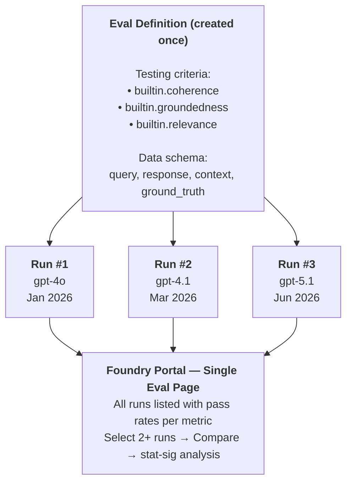
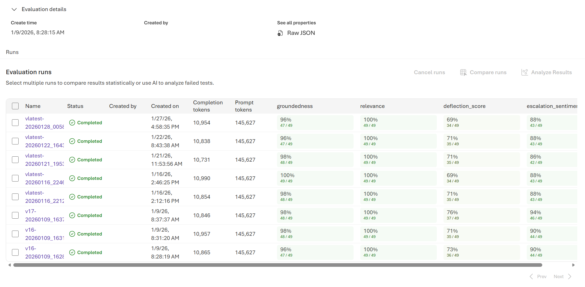

# Tracking Evaluation Metrics Across Model Migrations — Azure AI Foundry Cloud Evals

> **Audience:** Teams managing Azure OpenAI model migrations who want a single place to track quality metrics over time and across model versions.

## The Problem

Every model migration means answering the same question: **"Is the new model at least as good as the current one?"**

Most teams answer this by running one-off evaluation scripts, saving results to local JSON files or spreadsheets, and manually comparing numbers. This approach has three problems:

1. **No historical context** — When gpt-5.2 comes out, you don't have your gpt-4.1 baseline anymore. You re-run everything from scratch.
2. **No statistical rigor** — Eyeballing score averages doesn't tell you if a 0.2-point difference is real or noise.
3. **Scattered results** — Metrics live in different files, notebooks, or CI logs. No single place for stakeholders to review.

## The Solution: Reusable Eval Definitions in Azure AI Foundry

The Azure AI Foundry Evals API (v2, via `azure-ai-projects >= 2.0.0b3`) separates **eval definitions** from **runs**:

- An **eval definition** encodes your testing criteria (which metrics, what data schema, what pass/fail thresholds). You create it **once**.
- A **run** executes that eval against a specific dataset — typically responses from a specific model at a specific point in time. You create runs **repeatedly**, over months and model generations.

All runs under the same eval are visible in the Foundry portal on a single page, with built-in statistical comparison.



## What the Portal Shows

When you open an eval definition in the Foundry portal, you see all runs listed with their **pass rates per metric**:



*Source: [Microsoft Learn — See evaluation results in the Foundry portal](https://learn.microsoft.com/azure/ai-foundry/how-to/evaluate-results)*

Key things to notice:

- **Each row is a run** — named with a model identifier and timestamp (e.g., `v17-20260109`, `vlatest-20260128`). Name your runs after the model being evaluated for easy scanning.
- **Each column is a metric** — showing a pass rate (e.g., 96%, 47/49) and the count of items that passed. Green = good, red = regression.
- **Select 2+ runs → "Compare runs"** — generates a side-by-side comparison with **statistical t-testing** (not just average comparison). The portal color-codes cells as `ImprovedStrong`, `DegradedWeak`, `Inconclusive`, etc., with p-values.
- **"Analyze Results"** — uses AI to scan failed test cases and surface patterns.

### The Comparison View

When you select multiple runs and click **Compare runs**, the portal generates:

- **Baseline comparison**: set one run as the baseline (e.g., your current production model) and see how all others deviate.
- **Statistical t-testing per cell**: each metric comparison includes a significance assessment with p-values.

| Legend | Meaning |
|---|---|
| **ImprovedStrong** | p ≤ 0.001, moved in the desired direction |
| **ImprovedWeak** | 0.001 < p ≤ 0.05, moved in the desired direction |
| **DegradedStrong** | p ≤ 0.001, moved in the wrong direction |
| **DegradedWeak** | 0.001 < p ≤ 0.05, moved in the wrong direction |
| **Inconclusive** | Too few examples or p ≥ 0.05 |

This replaces ad-hoc "the average went down by 0.3" conversations with statistically grounded migration decisions.

## Step-by-Step Implementation

### Prerequisites

```bash
pip install "azure-ai-projects>=2.0.0b3" azure-identity openai
```

```bash
# .env
AZURE_AI_PROJECT_ENDPOINT=https://your-project.services.ai.azure.com/api/projects/proj-default
EVAL_MODEL_DEPLOYMENT=gpt-4.1
```

### Step 1 — Create the Eval Definition (Once)

Create a single eval definition that encodes your quality standards. **This is done once and reused for every future model evaluation.**

```python
import os
from azure.identity import DefaultAzureCredential
from azure.ai.projects import AIProjectClient

project_client = AIProjectClient(
    endpoint=os.environ["AZURE_AI_PROJECT_ENDPOINT"],
    credential=DefaultAzureCredential(),
)
client = project_client.get_openai_client()

model_deployment = os.environ["EVAL_MODEL_DEPLOYMENT"]

# Define testing criteria — these are your quality standards
testing_criteria = [
    {
        "type": "azure_ai_evaluator",
        "name": "coherence",
        "evaluator_name": "builtin.coherence",
        "initialization_parameters": {"deployment_name": model_deployment},
        "data_mapping": {
            "query": "{{item.query}}",
            "response": "{{item.response}}",
        },
    },
    {
        "type": "azure_ai_evaluator",
        "name": "groundedness",
        "evaluator_name": "builtin.groundedness",
        "initialization_parameters": {"deployment_name": model_deployment},
        "data_mapping": {
            "query": "{{item.query}}",
            "response": "{{item.response}}",
            "context": "{{item.context}}",
        },
    },
    {
        "type": "azure_ai_evaluator",
        "name": "relevance",
        "evaluator_name": "builtin.relevance",
        "initialization_parameters": {"deployment_name": model_deployment},
        "data_mapping": {
            "query": "{{item.query}}",
            "response": "{{item.response}}",
        },
    },
    {
        "type": "azure_ai_evaluator",
        "name": "fluency",
        "evaluator_name": "builtin.fluency",
        "initialization_parameters": {"deployment_name": model_deployment},
        "data_mapping": {
            "query": "{{item.query}}",
            "response": "{{item.response}}",
        },
    },
    # Safety evaluator — no deployment needed
    {
        "type": "azure_ai_evaluator",
        "name": "violence",
        "evaluator_name": "builtin.violence",
        "data_mapping": {
            "query": "{{item.query}}",
            "response": "{{item.response}}",
        },
    },
]

eval_obj = client.evals.create(
    name="model-migration-quality-gate",
    data_source_config={
        "type": "custom",
        "item_schema": {
            "type": "object",
            "properties": {
                "query": {"type": "string"},
                "response": {"type": "string"},
                "context": {"type": "string"},
                "ground_truth": {"type": "string"},
            },
            "required": ["query", "response"],
        },
    },
    testing_criteria=testing_criteria,
)

print(f"Eval ID: {eval_obj.id}")
# ⚠️ Save this ID — you will reuse it for every future model evaluation.
# Store it in your .env, config, or parameter store.
```

> **Tip:** Choose testing criteria that match your production workload. RAG apps should include `groundedness`; agentic apps should add `builtin.intent_resolution` and `builtin.tool_call_accuracy`. See the [built-in evaluators catalog](https://learn.microsoft.com/azure/ai-foundry/concepts/built-in-evaluators) for the full list.

### Step 2 — Prepare Your Golden Dataset

Create a JSONL file representing your production workload. This dataset should stay stable across model evaluations so comparisons are fair.

```jsonl
{"query": "What is our refund policy?", "response": "", "context": "Refunds within 30 days of purchase...", "ground_truth": "Refunds are available within 30 days."}
{"query": "How do I reset MFA?", "response": "", "context": "MFA can be reset from Security settings...", "ground_truth": "Go to Settings > Security > Reset MFA."}
```

The `response` field will be filled by each model when you run the evaluation. For **dataset evaluation** (pre-computed responses), fill it in advance. For **model target evaluation**, leave it empty and let the Foundry service generate responses at runtime (see Step 3b).

### Step 3a — Create Runs with Pre-computed Responses (Dataset Evaluation)

Generate responses from each model, then submit them as separate runs against the same eval:

```python
import time
from datetime import datetime
from openai.types.evals.create_eval_jsonl_run_data_source_param import (
    CreateEvalJSONLRunDataSourceParam,
    SourceFileContent,
    SourceFileContentContent,
)

EVAL_ID = "eval_abc123..."  # From Step 1

# Collect responses from your models (using src/clients.py or your own code)
from src.clients import create_client, call_model

models = {
    "gpt-4o": "GPT4O_DEPLOYMENT",
    "gpt-4.1": "GPT41_DEPLOYMENT",
    "gpt-5.1": "GPT51_DEPLOYMENT",
}

# Load your golden dataset
import json
with open("golden_dataset.jsonl") as f:
    golden_data = [json.loads(line) for line in f if line.strip()]

for model_name, deploy_env in models.items():
    deployment = os.environ.get(deploy_env, model_name)
    model_client = create_client(model_name)

    # Generate responses
    items = []
    for row in golden_data:
        response = call_model(
            model_client, model_name,
            messages=[
                {"role": "system", "content": "You are a helpful assistant."},
                {"role": "user", "content": row["query"]},
            ],
            deployment=deployment,
            max_tokens=1024,
        )
        items.append({
            "query": row["query"],
            "response": response.choices[0].message.content or "",
            "context": row.get("context", ""),
            "ground_truth": row.get("ground_truth", ""),
        })

    # Submit as a run
    content = [SourceFileContentContent(item=item) for item in items]

    run = client.evals.runs.create(
        eval_id=EVAL_ID,
        name=f"{model_name}_{datetime.now().strftime('%Y%m%d_%H%M')}",
        data_source=CreateEvalJSONLRunDataSourceParam(
            type="jsonl",
            source=SourceFileContent(type="file_content", content=content),
        ),
    )
    print(f"  Run for {model_name}: {run.id}")

    # Poll for completion
    while True:
        status = client.evals.runs.retrieve(run_id=run.id, eval_id=EVAL_ID)
        if status.status in ("completed", "failed"):
            print(f"  → {status.status} | Report: {getattr(status, 'report_url', 'N/A')}")
            break
        time.sleep(5)
```

### Step 3b — Create Runs with Model Targets (Foundry Generates Responses)

Alternatively, let Foundry call each model directly. This is simpler and avoids managing response generation yourself:

```python
# Upload dataset once
data = project_client.datasets.upload_file(
    name="golden-dataset",
    version="1.0",
    file_path="./golden_dataset.jsonl",
)

# Run the same eval against different models
for model_name in ["gpt-4o", "gpt-4.1", "gpt-5.1"]:
    run = client.evals.runs.create(
        eval_id=EVAL_ID,
        name=f"{model_name}_{datetime.now().strftime('%Y%m%d')}",
        data_source={
            "type": "azure_ai_target_completions",
            "source": {"type": "file_id", "id": data.id},
            "input_messages": {
                "type": "template",
                "template": [
                    {
                        "type": "message",
                        "role": "user",
                        "content": {"type": "input_text", "text": "{{item.query}}"},
                    }
                ],
            },
            "target": {
                "type": "azure_ai_model",
                "model": model_name,
                "sampling_params": {"max_completion_tokens": 1024},
            },
        },
    )
    print(f"  Run for {model_name}: {run.id}")
```

> **Note:** Model target evaluation requires the model to be deployed in your Azure OpenAI resource. The Foundry service generates responses and evaluates them in one step.

### Step 4 — Compare Runs in the Portal

1. Navigate to **Foundry portal → your project → Evaluation**
2. Open the **"model-migration-quality-gate"** eval definition
3. You see all runs listed with pass rates per metric (as shown in the screenshot above)
4. **Select the runs you want to compare** (tick the checkboxes)
5. Click **"Compare runs"**
6. The portal generates a side-by-side view with **statistical t-test results** color-coded by significance

No code needed for this step — the portal does the statistical analysis for you.

### Step 5 — Add Runs Over Time

When a new model becomes available (e.g., gpt-5.2), or when you update your golden dataset, simply create a new run against the **same eval ID**:

```python
# Months later, gpt-5.2 is released. Add a run to the existing eval:
run = client.evals.runs.create(
    eval_id=EVAL_ID,  # Same eval from Step 1 — no need to recreate
    name=f"gpt-5.2_{datetime.now().strftime('%Y%m%d')}",
    data_source={
        "type": "azure_ai_target_completions",
        "source": {"type": "file_id", "id": data.id},
        "input_messages": {
            "type": "template",
            "template": [
                {
                    "type": "message",
                    "role": "user",
                    "content": {"type": "input_text", "text": "{{item.query}}"},
                }
            ],
        },
        "target": {
            "type": "azure_ai_model",
            "model": "gpt-5.2",
            "sampling_params": {"max_completion_tokens": 1024},
        },
    },
)
```

This run appears alongside all previous runs in the portal. You can now compare gpt-5.2 against your original gpt-4o baseline from months ago — **all in one view**.

## Using the Repo's `FoundryEvalsClient` (Shortcut)

This repo wraps the pattern above in `src/evaluate/foundry.py`. The `FoundryEvalsClient` handles eval creation, run submission, polling, and result parsing:

```python
from src.evaluate.foundry import FoundryEvalsClient

foundry = FoundryEvalsClient()

# Step 1: Create eval (once)
eval_id = foundry.create_eval(
    name="migration-quality-gate",
    metrics=["coherence", "groundedness", "relevance", "fluency"],
)

# Step 2: Collect responses from both models
from src.evaluate.scenarios import create_rag_evaluator

evaluator = create_rag_evaluator("gpt-4o", "gpt-4.1")
source_items, target_items = evaluator.collect()

# Step 3: Create runs for each model
source_run_id = foundry.run_eval(eval_id, source_items, run_name="gpt-4o_baseline")
target_run_id = foundry.run_eval(eval_id, target_items, run_name="gpt-4.1_candidate")

# Step 4: Wait and get results
source_result = foundry.wait_for_completion(eval_id, source_run_id)
target_result = foundry.wait_for_completion(eval_id, target_run_id)

print(f"Source report: {source_result.get('report_url')}")
print(f"Target report: {target_result.get('report_url')}")

# Step 5: Later, add gpt-5.1 — same eval_id, new run
# five_one_run_id = foundry.run_eval(eval_id, five_one_items, run_name="gpt-5.1_candidate")
```

## Best Practices

### Naming Conventions

Name your runs consistently so they're easy to scan in the portal:

| Pattern | Example | When |
|---|---|---|
| `{model}_{date}` | `gpt-4.1_20260315` | Standard migration comparison |
| `{model}_{dataset_version}` | `gpt-4.1_golden-v3` | After updating your golden dataset |
| `{model}_{scenario}` | `gpt-5.1_rag-only` | Scenario-specific evaluations |
| `{model}_{env}` | `gpt-4.1_prod-sample` | Production traffic evaluation |

### Golden Dataset Versioning

When you update your golden dataset (new test cases, removed stale ones), **create a new eval definition** or clearly version your runs. Comparing runs from different datasets under the same eval is misleading because pass rates aren't comparable across different test sets.

```python
# New dataset version → new eval definition
eval_v2 = client.evals.create(
    name="migration-quality-gate-v2",   # Versioned name
    data_source_config=same_schema,
    testing_criteria=same_criteria,
)
```

### Multiple Eval Definitions for Different Workloads

If your application has distinct workloads (RAG, tool calling, classification), create a separate eval definition for each:

```
migration-quality-gate-rag          → coherence, groundedness, relevance
migration-quality-gate-tool-calling → intent_resolution, tool_call_accuracy
migration-quality-gate-safety       → violence, self_harm, hate_unfairness
```

Each eval becomes a focused dashboard for one concern. Stakeholders can review what matters to them.

### Automating with CI/CD

Add a run to your eval from a CI pipeline after every model change or on a schedule:

```yaml
# .github/workflows/eval-on-model-change.yml
name: Model Evaluation
on:
  workflow_dispatch:
    inputs:
      model_name:
        description: 'Model to evaluate'
        required: true
        default: 'gpt-4.1'

jobs:
  evaluate:
    runs-on: ubuntu-latest
    steps:
      - uses: actions/checkout@v4
      - uses: azure/login@v2
        with:
          client-id: ${{ vars.AZURE_CLIENT_ID }}
          tenant-id: ${{ vars.AZURE_TENANT_ID }}
          subscription-id: ${{ vars.AZURE_SUBSCRIPTION_ID }}
      - run: pip install -r requirements.txt
      - run: |
          python -c "
          from src.evaluate.foundry import FoundryEvalsClient
          foundry = FoundryEvalsClient()
          # Use persisted eval_id from config
          eval_id = '${{ vars.FOUNDRY_EVAL_ID }}'
          # ... collect items, run_eval, wait_for_completion
          "
        env:
          AZURE_AI_PROJECT_ENDPOINT: ${{ secrets.AZURE_AI_PROJECT_ENDPOINT }}
          EVAL_MODEL_DEPLOYMENT: ${{ vars.EVAL_MODEL_DEPLOYMENT }}
```

## When to Use This vs. Other Approaches

| Approach | Best For | Tracking Over Time? |
|---|---|---|
| **This technique (v2 eval reuse)** | Production migration gates, stakeholder visibility, statistical rigor | ✅ All runs in one portal page |
| Built-in LLM-as-Judge (`MigrationEvaluator`) | Quick local prototyping, no Azure dependencies | ❌ Results in local JSON only |
| Local SDK (`azure-ai-evaluation`) | CI/CD gates, fast iteration, custom evaluators | ⚠️ Only if you pass `azure_ai_project` to log to Foundry |
| One-off v2 eval (new eval per run) | Quick experiments | ❌ Results scattered across eval definitions |

## References

- [See evaluation results in the Foundry portal](https://learn.microsoft.com/azure/ai-foundry/how-to/evaluate-results) — portal walkthrough with comparison features
- [Run evaluations in the cloud (SDK)](https://learn.microsoft.com/azure/ai-foundry/how-to/develop/cloud-evaluation) — v2 SDK reference
- [Built-in evaluators catalog](https://learn.microsoft.com/azure/ai-foundry/concepts/built-in-evaluators) — all available metrics
- [Azure OpenAI Evals API](https://learn.microsoft.com/azure/ai-foundry/openai/how-to/evaluations) — API reference
- [Continuous evaluation for agents](https://learn.microsoft.com/azure/ai-foundry/how-to/continuous-evaluation-agents) — scheduled and rule-based evaluation
