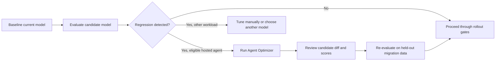

# Foundry Agent Optimizer for Model Migrations

> **Last verified: July 2026.** Agent Optimizer capabilities and availability can change during preview. For model lifecycle dates, always verify the [official Azure OpenAI model retirements page](https://learn.microsoft.com/en-us/azure/ai-foundry/openai/concepts/model-retirements).

Microsoft Foundry Agent Optimizer automates part of the remediation loop for eligible hosted agents. It evaluates a baseline agent, generates candidate configurations, evaluates those candidates against the same dataset, and ranks the results.

> **⚠️ Important:** Agent Optimizer is in preview, has no service-level agreement, and is not recommended for production workloads. Access currently requires an allow-listed Azure subscription. Review the [official preview guidance](https://learn.microsoft.com/azure/foundry/agents/concepts/agent-optimizer-overview) before adopting it.

## Where It Fits in a Migration

Agent Optimizer is **not a replacement or fourth approach for migration evaluation**. It uses evaluation internally, but it does not replace the source-versus-target quality gate:



Use the repository's [Evaluation Guide](evaluation-guide.md) to establish the source-model baseline and identify regressions first. Use Agent Optimizer only as a possible remediation step after you know what failed.

## Current Eligibility

The current documented workflow is appropriate when all of these conditions are true:

| Requirement | Why It Matters |
|---|---|
| The application is a Microsoft Foundry **hosted agent** | Agent Optimizer targets deployed hosted agents, not arbitrary model endpoints |
| The hosted agent uses the **Responses protocol** | Other hosted-agent protocols are not currently supported |
| The agent follows the current Python optimizer-ready path | The integration uses Python 3.10+ and `azure-ai-agentserver-optimization` |
| The agent can load a baseline from `.agent_configs/baseline/` | The optimizer needs instructions and metadata; tools and skills are optional |
| The optimization recipe defines a representative dataset and evaluators | Candidates must be scored against workload-specific success criteria |
| The Foundry project has eval and optimization model deployments | The eval model scores responses; the optimization model generates candidates |
| The subscription is allow-listed and the region is supported | Preview access is restricted; Norway East is currently excluded |

For prompt agents, non-hosted applications, unsupported protocols, or production-only environments, continue with manual prompt/model remediation and the evaluation workflows already documented in this repository.

## What It Can Optimize

Agent Optimizer can improve four configuration surfaces:

| Target | What Changes |
|---|---|
| **Instructions** | Rewrites the system instructions |
| **Skills** | Refines Agent Skills used by the hosted agent |
| **Tools** | Improves tool and parameter descriptions without changing tool implementation code |
| **Model selection** | Evaluates configured model deployments against the same dataset |

Your business logic and tool implementations remain under your control. Treat every generated candidate as a proposed configuration change that requires review.

## Migration-Safe Workflow

1. **Establish the migration baseline.** Run the current and candidate models against the same representative golden dataset.
2. **Diagnose the regression.** Confirm whether the issue is instruction adherence, tool selection, parameter extraction, response quality, or model choice.
3. **Prepare the hosted agent.** Add `azure-ai-agentserver-optimization`, create `.agent_configs/baseline/`, and load it with `load_config()`.
4. **Review the optimization recipe.** Generate or author `eval.yaml`, then verify its dataset, evaluators, eval model, optimization model, and optional model search space.
5. **Run optimization.** Compare every candidate with the baseline. If all candidates score lower, keep the baseline.
6. **Apply locally first.** Apply the selected candidate to source control, inspect the diff, and do not use direct deployment as the default path.
7. **Validate in isolation.** Deploy the candidate only to an isolated non-production environment, then evaluate it with a held-out dataset that was not used to generate candidates.
8. **Proceed through the normal migration plan.** Promote only after the held-out evaluation passes, using canary rollout, monitoring, and rollback gates.

The core CLI flow is:

```bash
azd ai agent eval generate
azd ai agent eval run --config eval.yaml
azd ai agent optimize --config eval.yaml --optimize-model <deployment-name>
azd ai agent optimize apply --candidate <candidate-id>
git diff -- .agent_configs azure.yaml

# Select an isolated non-production azd environment before deploying.
azd deploy
azd ai agent eval run --config eval.heldout.yaml
```

`eval.heldout.yaml` should reference migration cases that were not used by the optimizer. Passing this non-production check is a gate for production promotion, not permission to skip the normal rollout plan.

> **⚠️ Important:** Optimization invokes the agent once per task for the baseline and each candidate. External tools run for real unless you replace them with safe test endpoints or mocks. Prevent state-changing actions, unexpected charges, and rate-limit pressure during optimization.

## Review Checklist

- [ ] Baseline and candidate use the same representative migration dataset
- [ ] A held-out validation set checks for overfitting to the optimizer dataset
- [ ] Tool calls are safe, mocked, or pointed at non-production systems
- [ ] Candidate changes to instructions, skills, tools, and model are reviewed in source control
- [ ] Quality, safety, latency, and token usage are compared with the original baseline
- [ ] The candidate is deployed only after it passes the existing migration gates
- [ ] Rollback restores the previous agent configuration and model deployment

## Official Documentation

- [What is the Agent Optimizer?](https://learn.microsoft.com/azure/foundry/agents/concepts/agent-optimizer-overview)
- [Make your agent optimizer-ready](https://learn.microsoft.com/azure/foundry/agents/how-to/make-agent-optimizer-ready)
- [Optimize agent instructions, skills, tools, and models](https://learn.microsoft.com/azure/foundry/agents/how-to/optimize-agent-targets)
- [Quickstart: Optimize a hosted agent](https://learn.microsoft.com/azure/foundry/agents/quickstarts/quickstart-optimize-hosted-agent)
- [Migrating Multi-Step Applications](migrating-multi-step-apps.md)
- [Cloud Eval Tracking](cloud-eval-tracking-across-models.md)
