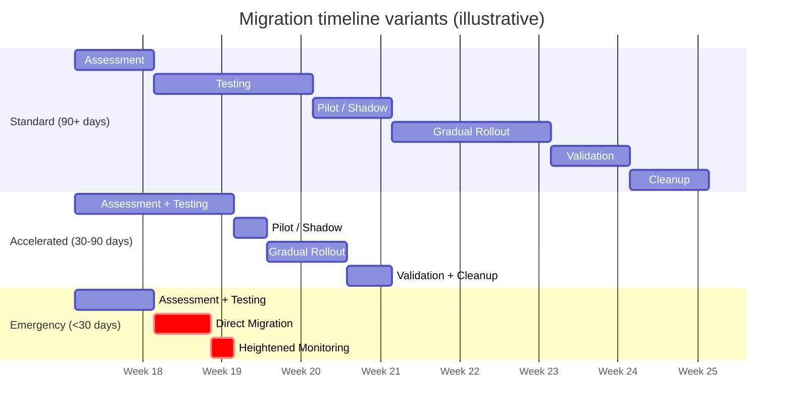

# Migration Execution Guide — Phased Rollout for Azure OpenAI Models

> **⚠️ Important:** Model retirement dates, regional availability, and replacement targets change frequently. Before you commit to a rollout plan, verify the current state on the **[official Azure OpenAI Model Retirements page](https://learn.microsoft.com/en-us/azure/ai-foundry/openai/concepts/model-retirements)** and confirm availability in every required region.
>
> **Last verified:** May 2026  
> **Audience:** Platform teams, SREs, engineering leads

---

## Overview

Migrating an LLM in production is not a simple deployment. A model change can affect output quality, latency, token consumption, cost, tool behavior, and overall user experience.

A phased rollout with explicit gates reduces risk. Instead of switching all traffic at once, treat model migration like any other production change: establish a baseline, validate quality, pilot safely, scale gradually, and keep rollback ready until the migration is formally approved.

---

## Pre-Migration Checklist

Before starting execution, confirm the following prerequisites are complete:

- [ ] Target model selected ([migration paths](migration-paths.md))
- [ ] Feasibility assessment completed ([migration feasibility assessment](migration-feasibility-assessment.md))
- [ ] Code changes identified ([API changes by model](api-changes-by-model.md))
- [ ] Golden dataset prepared ([building golden datasets](building-golden-datasets.md))
- [ ] Baseline metrics captured on the current model
- [ ] Rollback procedure documented

> **💡 Tip:** Capture baseline metrics from the current production model before changing anything. You need a stable comparison point for quality, latency, error rate, and cost.

---

## Phase 1: Assessment (Week 1)

**Goal:** Confirm that the migration is operationally viable and worth executing.

| Activity | What to do | Output |
|----------|------------|--------|
| Confirm regional availability | Verify the target model is available in every required Azure region, deployment type, and environment. | Region-by-region availability checklist |
| Estimate cost impact | Compare projected input, output, and reasoning token usage against the current model. Use the official **[Azure OpenAI pricing page](https://azure.microsoft.com/pricing/details/cognitive-services/openai-service/)** for current pricing. | Cost projection and budget impact summary |
| Inventory deployments | Identify every deployment, app, batch job, and service that still uses the source model. | Deployment inventory |
| Identify dependencies | Review downstream systems, cached prompts, response schema consumers, rate limits, and any fine-tuned or version-pinned dependencies. | Dependency map |
| Align stakeholders | Review scope, timeline, owners, and change windows with platform, application, and support teams. | Approved execution plan |

> **Gate:** Documented go/no-go decision with stakeholder sign-off.

---

## Phase 2: Testing (Weeks 2-3)

**Goal:** Prove the candidate model is acceptable in a non-production environment.

| Activity | What to do | Output |
|----------|------------|--------|
| Deploy target model | Create the target deployment in a non-production environment that mirrors production configuration as closely as possible. | Non-production deployment |
| Run golden dataset evaluation | Execute the **[evaluation guide](evaluation-guide.md)** workflow against the source and target models using your real prompts and scenarios. | Evaluation report |
| Compare quality metrics | Review coherence, relevance, groundedness, and fluency scores. Add task-specific checks if your workload depends on tool calling, JSON schemas, or multi-step orchestration. | Quality comparison summary |
| Test prompt compatibility | Validate prompt templates, roles, parameters, and response formatting. Adapt prompts as needed using the guidance in **[API changes by model](api-changes-by-model.md)**. | Prompt compatibility checklist |
| Load test the candidate | Measure P50, P95, and P99 latency, throughput, retry volume, timeouts, and error rates under expected load. | Performance test results |

> **📝 Note:** Define acceptable thresholds before testing begins. If the target model must stay within 5% of baseline for a key metric, document that before you run the comparison.
>
> **Gate:** All quality metrics are within acceptable thresholds, and no regressions exceed 5%.

---

## Phase 3: Pilot / Shadow (Week 4)

**Goal:** Validate the model under real production traffic without committing fully.

| Activity | What to do | Output |
|----------|------------|--------|
| Route a pilot slice | Send 5-10% of production traffic to the candidate model. Start with low-risk routes or internal users where possible. | Pilot routing change |
| Run shadow mode | If your architecture allows it, send the same requests to both source and target models, compare outputs, but continue serving responses from the source model. | Shadow comparison log |
| Monitor production signals | Track error rates, latency percentiles, token usage, cost per request, and user feedback or satisfaction signals. | Pilot dashboard |
| Hold long enough to see variation | Keep the pilot live for at least 7 days so you capture weekday/weekend patterns, background jobs, and support escalations. | One-week production evidence |

> **💡 Tip:** Shadow mode is especially useful when the output is reviewed by humans, downstream systems are sensitive to format changes, or you need evidence before exposing users to the new model.
>
> **Gate:** Pilot metrics are stable and within tolerance of baseline.

---

## Phase 4: Gradual Rollout (Weeks 5-6)

**Goal:** Move production traffic incrementally while keeping rollback fast and simple.

| Rollout step | Traffic share | Minimum hold time | Proceed only if... |
|--------------|---------------|-------------------|--------------------|
| Step 1 | 25% | 24-48 hours | Error rate, latency, cost, and quality remain within tolerance |
| Step 2 | 50% | 24-48 hours | No rollback trigger breached; support signals remain normal |
| Step 3 | 75% | 24-48 hours | Metrics stay stable after sustained load |
| Step 4 | 100% | 24-48 hours | The new model behaves like the expected steady state |

Operational rules for this phase:

- Keep the source model deployment active. **Do not delete it yet.**
- Define rollback trigger criteria before increasing traffic.
- Freeze rollout immediately if a trigger is breached.
- Treat each increment as a separate approval point.

> **Gate:** Each increment completes with stable metrics before the next traffic increase.
>
> **Rollback procedure:** Switch traffic back to the source model immediately if rollback criteria are breached.

---

## Phase 5: Validation (Week 7)

**Goal:** Confirm the migration is complete, stable, and ready for formal approval.

| Activity | What to do | Output |
|----------|------------|--------|
| Confirm 100% traffic | Verify all production traffic is served by the new model and no unintended callers still hit the source deployment. | Traffic validation report |
| Re-run the evaluation suite | Execute the full evaluation workflow one final time against the production-ready configuration. | Final evaluation package |
| Validate cost | Compare real token usage and cost per request against the projections created in Phase 1. | Cost validation summary |
| Document prompt changes | Capture every prompt, parameter, routing, and schema adjustment made during testing and rollout. | Migration change log |
| Collect stakeholder sign-off | Review results with platform, product, security, and support stakeholders. | Approved migration record |

> **Gate:** Formal migration approval.

---

## Phase 6: Cleanup (Week 8)

**Goal:** Remove temporary migration artifacts and return to steady-state operations.

| Activity | What to do | Output |
|----------|------------|--------|
| Decommission the source deployment | Remove the old deployment only after the grace period ends and validation is complete. | Retired source deployment |
| Archive evidence | Store rollout notes, dashboards, evaluation outputs, and incident links for future audits. | Archived migration package |
| Update operations artifacts | Refresh runbooks, dashboards, on-call notes, and alert thresholds for the new model. | Updated operational docs |
| Update configuration | Remove hardcoded model references, stale deployment names, and temporary feature flags. | Clean configuration state |
| Close the work item | Complete the migration ticket, project, or change record. | Closed migration record |

> **📝 Note:** Cleanup should happen only after the team agrees the migration is complete and rollback is no longer needed.

---

## Rollback Strategy

Rollback planning is part of the migration, not a last-minute contingency. Define triggers before the pilot starts and rehearse the traffic switch before production rollout begins.

### When to roll back

| Signal | Example quantitative trigger | Action |
|--------|------------------------------|--------|
| Error rate | Sustained HTTP 4xx/5xx error rate exceeds **2x baseline** for 15 minutes | Roll back immediately |
| Latency | P95 latency exceeds baseline by **50% or more** for 30 minutes | Freeze rollout and roll back if not quickly explained |
| Quality | One or more critical quality metrics drop by **more than 5%** versus baseline | Roll back and investigate prompt/model fit |
| Schema or tool failures | Structured output failures or tool-call errors exceed **1%** of requests | Roll back if downstream systems are affected |
| Cost | Cost per request exceeds the projected range by **20% or more** without a clear business reason | Pause rollout and evaluate whether to roll back |
| User impact | A Sev1 incident or repeated Sev2 user-impacting issues are tied to the new model | Roll back immediately |

### How to roll back

1. Stop any planned traffic increase.
2. Switch routing, deployment configuration, or feature flags back to the source model.
3. Confirm that traffic is flowing to the source deployment and that baseline latency and error rates are recovering.
4. Leave the candidate deployment available for investigation unless there is a safety or cost reason to disable it.
5. Notify stakeholders, on-call responders, and support teams that rollback has been executed.
6. Capture the exact time window, affected traffic percentage, failing prompts, and triggering metrics.

### Post-rollback

- Analyze what failed: quality regression, latency spike, schema drift, tool behavior, or cost increase.
- Re-run evaluation using the failed production examples.
- Adjust prompts, parameters, thresholds, or routing before attempting another pilot.
- Update the test plan so the same failure mode is caught earlier next time.

> **⚠️ Important:** NEVER delete the source deployment until validation is complete and the migration has formal approval.

---

## Timeline Variants

Choose the timeline that matches the runway you actually have before retirement or change deadlines.

| Variant | When to use it | Shape of the plan | Trade-off |
|---------|----------------|-------------------|-----------|
| **Standard** | 90+ days available | Full 8-week plan with every gate | Lowest risk, highest confidence |
| **Accelerated** | 30-90 days available | Combine Assessment + Testing, shorten Pilot to 3 days, compress approvals | Moderate risk; less time to observe production behavior |
| **Emergency** | Less than 30 days available | Compress to 2 weeks, skip Pilot, move from Testing directly to Migration with heightened monitoring | Highest risk; requires tight rollback discipline |

> **📝 Note:** Use the emergency timeline only when retirement pressure or a production incident leaves no practical alternative.

---

## Monitoring Checklist

Use the same dashboards and alert thresholds from baseline through final validation so every comparison is apples-to-apples.

| Signal | Why it matters | Most important during |
|--------|----------------|-----------------------|
| Error rates (HTTP 4xx/5xx) | Detect availability, auth, quota, and compatibility failures quickly | Pilot, gradual rollout, rollback |
| Latency (P50, P95, P99) | Validate user experience and downstream timeout budgets | Testing, pilot, gradual rollout |
| Token consumption (input + output + reasoning) | Detect unexpected prompt expansion or reasoning token cost | Testing, pilot, validation |
| Cost per request | Verify the model stays within budget expectations | Pilot, gradual rollout, validation |
| Quality metrics | Catch semantic regressions if continuous evaluation is enabled | Testing, pilot, validation |
| User feedback / satisfaction scores | Detect issues automated metrics may miss | Pilot, gradual rollout, validation |

Operational checklist:

- [ ] Error rates (HTTP 4xx/5xx)
- [ ] Latency (P50, P95, P99)
- [ ] Token consumption (input + output + reasoning)
- [ ] Cost per request
- [ ] Quality metrics (if continuous evaluation is set up)
- [ ] User feedback / satisfaction scores

---

## Next Steps

- [Migration Paths](migration-paths.md)
- [Migration Feasibility Assessment](migration-feasibility-assessment.md)
- [Evaluation Guide](evaluation-guide.md)
- [Cloud Eval Tracking Across Models](cloud-eval-tracking-across-models.md)
- [API Changes by Model](api-changes-by-model.md)
