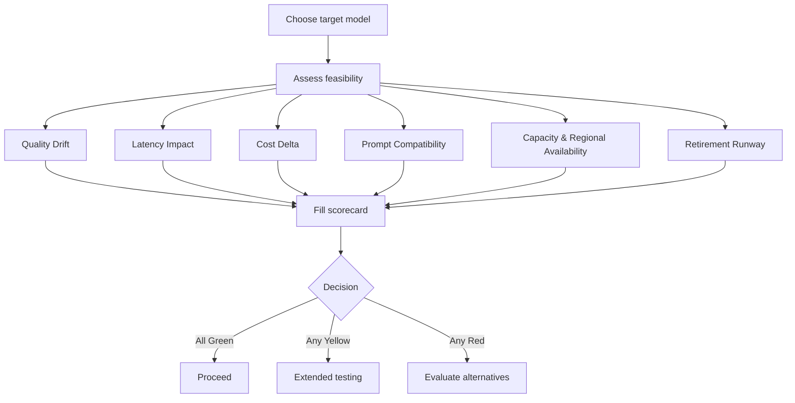

# Migration Feasibility Assessment Framework

> **⚠️ Important:** Retirement dates, model capabilities, and regional availability change frequently. Always verify against the **[official Azure OpenAI Model Retirements page](https://learn.microsoft.com/en-us/azure/ai-foundry/openai/concepts/model-retirements)** before committing to a migration plan.
>
> Last verified: **May 2026**

## Overview

Choosing the right target model is only step one. Before committing engineering time, budget, and rollout planning, evaluate whether the migration is actually feasible for **your** workload.

This guide provides a practical framework for assessing migration feasibility across six dimensions:

1. **Quality Drift**
2. **Latency Impact**
3. **Cost Delta**
4. **Prompt Compatibility**
5. **Capacity & Regional Availability**
6. **Retirement Runway**

Use this framework after reading **[Migration Paths](migration-paths.md)** and before starting implementation work.

---

## The Six Dimensions

### 1. Quality Drift

**What it measures**

Whether the target model maintains acceptable output quality for your specific workload, including domain terminology, formatting, tool use, and instruction-following behavior.

**How to evaluate it**

- Run a representative **golden dataset** through both the current and target models.
- Use **LLM-as-Judge** scoring rather than similarity-only metrics.
- Review failures by scenario: RAG, tool calling, translation, classification, structured output, and policy-sensitive prompts.
- Include examples from your highest-risk workflows, not just generic prompts.

See **[Evaluation Guide](evaluation-guide.md)** and **[Tracking Evaluation Metrics Across Model Migrations](cloud-eval-tracking-across-models.md)**.

**Risk indicators**

| Indicator | Why it matters |
|----------|----------------|
| Regressions on domain-specific prompts | General benchmark gains may hide failures in specialized tasks such as medical terminology or legal reasoning |
| More hallucinations or weaker grounding | Especially risky for RAG, compliance, and factual workflows |
| Schema adherence drops | Breaks downstream automation even if the text looks acceptable |
| Tone or policy behavior changes | Can create customer-facing inconsistency |

**Suggested action if risk is high**

- Do not proceed based on benchmark claims alone.
- Expand the golden dataset with failure-heavy cases.
- Try a different target model or model tier.
- Add prompt adjustments and rerun evaluations before committing to code changes.

> **💡 Tip:** If a smaller newer model performs as well as or better than your current model on your golden dataset, it may be a better migration target than the obvious one.

### 2. Latency Impact

**What it measures**

How much the target model changes user-perceived response time and end-to-end system latency.

**How to evaluate it**

- Load test with representative prompts, context sizes, and output lengths.
- Measure **P50, P95, and P99** latency for both models.
- Test realistic concurrency, not just single-request timing.
- Separate interactive requests from background or batch workflows.

**Expected pattern**

| Model type | Typical expectation |
|-----------|---------------------|
| Standard models (for example, GPT-4.1) | Often similar latency to GPT-4o |
| Reasoning models (GPT-5 family, o-series) | Can be **2-10x slower** because they generate reasoning before the final answer |

**Risk indicators**

| Workload type | Latency risk |
|--------------|--------------|
| Real-time / interactive chat | **High** |
| Human-in-the-loop async workflows | **Medium** |
| Offline batch processing | **Low** |

Additional concerns:

- Timeouts begin appearing at peak load.
- Streaming starts later even if total quality improves.
- Tool-calling workflows become slower because model time is compounded across steps.

**Suggested action if risk is high**

- Test a lower-latency target model or smaller tier.
- Reduce prompt/context size where possible.
- Use reasoning selectively rather than globally.
- Keep interactive and batch workloads on different model profiles.

> **📝 Note:** A model that is feasible for overnight document processing may be infeasible for a live customer chatbot.

### 3. Cost Delta

**What it measures**

How the migration changes operating cost for your actual traffic profile.

**How to evaluate it**

- Compare **input** and **output** token pricing separately.
- Estimate cost using your real prompt lengths, context size, and response size.
- Measure total cost per transaction or workflow, not just per request.
- Include evaluation cost, retry cost, and tool-call amplification where relevant.

Use the official **[Azure OpenAI pricing page](https://azure.microsoft.com/pricing/details/cognitive-services/openai-service/)** for current pricing.

**Risk indicators**

| Indicator | Why it matters |
|----------|----------------|
| Output-heavy workloads | Output tokens can dominate total cost |
| Reasoning models with internal reasoning tokens | Final answers may look short while total billed output is higher |
| Long-context RAG prompts | Even small per-token changes compound quickly |
| Multi-step agent flows | Small per-call increases multiply across tool loops |

**Suggested action if risk is high**

- Model the cost using real production traffic samples.
- Consider a **tier-down strategy** where a newer smaller model replaces an older larger one.
- Reserve higher-cost reasoning models for high-value scenarios only.
- Set budget guardrails before rollout.

> **💡 Tip:** A manual migration is a good time to test whether a newer mini or nano model can replace an older larger model without unacceptable quality loss.

### 4. Prompt Compatibility

**What it measures**

How much prompt, parameter, and application logic rewrite is required to make the new model behave correctly.

**How to evaluate it**

- Review differences in roles, parameters, structured output behavior, and reasoning support.
- Test your most important system/developer prompts directly.
- Validate schema-following, tool selection, and stop-condition behavior.
- Inventory any logic that assumes `temperature`, `top_p`, `max_tokens`, or the `system` role.

See **[Key API Changes by Model Family](api-changes-by-model.md)**.

**Risk indicators**

| Compatibility level | Typical scenario |
|--------------------|------------------|
| **Low** | Same general prompting pattern and minor parameter updates, such as GPT-4o → GPT-4.1 |
| **Medium** | Role and parameter adaptation needed, such as moving to GPT-5 with `developer` role and unsupported parameter removal |
| **High** | Fundamental redesign needed, such as removing explicit chain-of-thought instructions or reworking prompt scaffolding for reasoning models |

**Suggested action if risk is high**

- Budget prompt refactoring as real engineering work.
- Test prompt variants before changing application code.
- Remove brittle prompt instructions that depend on legacy model quirks.
- Roll out by scenario rather than switching every workload at once.

> **⚠️ Important:** “API compatible” does not mean “behaviorally compatible.” Prompt semantics often matter more than client syntax.

### 5. Capacity & Regional Availability

**What it measures**

Whether the target model can be deployed in the regions, deployment types, and capacity envelope your application requires.

**How to evaluate it**

- Check Azure AI Foundry portal or the model availability REST API for your subscription and regions.
- Verify the required deployment type: **Standard**, **Provisioned**, or **Global Standard**.
- Confirm quota and expected throughput, not just model visibility.
- Identify fallback regions and measure the latency effect of cross-region routing.

**Risk indicators**

| Indicator | Why it matters |
|----------|----------------|
| Target model unavailable in required region | Can block migration entirely |
| Only available in a deployment type you do not use | May force architecture or cost changes |
| Quota too low for side-by-side testing | Delays validation and rollout |
| DR / backup region lacks the model | Creates resilience gaps |

**Suggested action if risk is high**

- Evaluate an alternative region and quantify the latency tradeoff.
- Request quota early if provisioned capacity is required.
- Use a different target model if regional constraints are strict.
- Confirm primary and secondary region plans before rollout approval.

> **📝 Note:** A model can be technically “available” but still infeasible if your required region, quota, or deployment type is not.

### 6. Retirement Runway

**What it measures**

How much useful life remains in the **target** model before you have to migrate again.

**How to evaluate it**

- Check the target model on the **[Retirement Timeline](retirement-timeline.md)**.
- Prefer models with at least **12 months** of remaining life when possible.
- Treat anything under **6 months (180 days)** as a major warning sign.
- Factor in procurement, testing, rollout, and compliance timelines.

**Risk indicators**

| Remaining runway | Assessment |
|------------------|------------|
| 12+ months | Preferred |
| 6-12 months | Caution |
| Under 6 months | High risk |

**Suggested action if risk is high**

- Avoid migrating to a target that will force another near-term migration.
- Reassess whether a newer model family gives you more runway.
- Prefer a model with a longer overlap window, even if it requires slightly more prompt work.

> **💡 Tip:** A migration that solves this quarter's retirement deadline but creates another deadline six months later is usually not the best path.

---

## Assessment Scorecard Template

Use this table to record your findings.

| Dimension | Rating | Notes |
|-----------|--------|-------|
| Quality Drift | Green / Yellow / Red | |
| Latency Impact | Green / Yellow / Red | |
| Cost Delta | Green / Yellow / Red | |
| Prompt Compatibility | Green / Yellow / Red | |
| Capacity & Regional Availability | Green / Yellow / Red | |
| Retirement Runway | Green / Yellow / Red | |

### Rating Guidance

| Rating | Meaning | Recommended interpretation |
|--------|---------|----------------------------|
| **Green** | Feasible with normal migration work | Proceed |
| **Yellow** | Feasible, but requires mitigation or extra testing | Proceed with caution |
| **Red** | Significant blocker or high uncertainty | Evaluate alternatives |

> **💡 Tip:** Capture evidence in the notes column: eval results, latency percentiles, pricing assumptions, region constraints, and retirement dates.

---

## Decision Matrix

Use the completed scorecard to choose the next action.

| Scorecard result | Recommendation |
|------------------|----------------|
| All Green | Proceed with standard testing and rollout planning |
| Any Yellow, no Red | Proceed, but run extended testing and explicitly address Yellow items |
| Any Red | Evaluate alternative target models before proceeding |
| 2+ Red | Strongly consider a different migration path |

A simple way to operationalize this is:

- **Green path:** Standard validation, rollout plan, and production change management.
- **Yellow path:** Add targeted mitigations, such as prompt tuning, canary rollout, or region planning.
- **Red path:** Return to **[Migration Paths](migration-paths.md)** and reassess the target model.

---

## Worked Example — Contoso Customer Chatbot

**Scenario:** Contoso is migrating a customer-facing chatbot from **GPT-4o** to **GPT-5.4**. The chatbot answers policy questions, summarizes support cases, and occasionally calls tools to retrieve account information.

| Dimension | Example finding | Rating | Suggested action |
|-----------|-----------------|--------|------------------|
| Quality Drift | GPT-5.4 improves difficult reasoning prompts, but two policy-answer prompts become less grounded | Yellow | Expand RAG eval set and tune grounding prompts before rollout |
| Latency Impact | Median latency is acceptable, but P95 is materially slower during interactive chat | Red | Test GPT-5.4-mini or use GPT-5.4 only for escalated conversations |
| Cost Delta | Cost per conversation rises because answers are longer and reasoning adds output overhead | Yellow | Compare against GPT-5.4-mini and use routing by conversation type |
| Prompt Compatibility | `system` role and unsupported parameters need refactoring; chain-of-thought instructions should be removed | Yellow | Update prompts and API parameters before application testing |
| Capacity & Regional Availability | Primary region supports the model, but the secondary DR region does not yet | Red | Delay broad rollout or select a target with dual-region coverage |
| Retirement Runway | GPT-5.4 offers strong runway into 2027 | Green | No action needed |

**Assessment outcome:** Because Contoso has **2 Red** dimensions, GPT-5.4 is not yet the best default migration target for this chatbot. A better path may be:

1. Test **GPT-5.4-mini** as the primary interactive model.
2. Reserve **GPT-5.4** for complex escalations.
3. Re-run the scorecard after prompt updates and region planning.

This is exactly why a feasibility assessment matters: the “best” model on paper is not always the best fit for the workload.

---

## Next Steps

After completing the feasibility assessment:

1. Use **[Migration Paths](migration-paths.md)** to confirm the best target model.
2. Use **[Evaluation Guide](evaluation-guide.md)** to build and run your validation suite.
3. Use **[Migration Execution Guide](migration-execution-guide.md)** to plan the phased rollout.
4. Use **[Key API Changes by Model Family](api-changes-by-model.md)** to implement required code and prompt updates.

> **📝 Note:** Revisit this scorecard whenever the target model, region plan, deployment type, or workload shape changes. Feasibility is not a one-time decision.