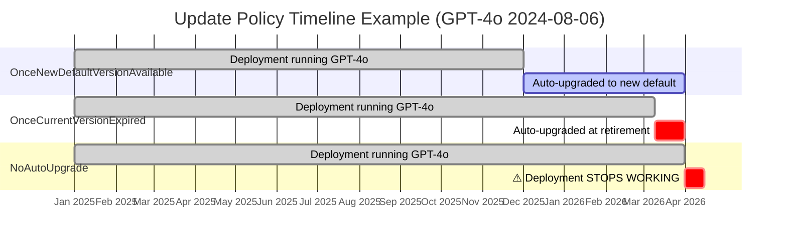

# Retirement Timeline

> **⚠️ Retirement dates and model availability change frequently.** Always verify against the **[official Azure OpenAI Model Retirements page](https://learn.microsoft.com/en-us/azure/ai-foundry/openai/concepts/model-retirements)** for the latest authoritative information.
>
> This page was last updated **February 2026**.

---

## Models Being Retired

### GPT-4o

| Deployment Type | GPT-4o (2024-05-13, 2024-08-06) | GPT-4o (2024-11-20) |
|----------------|----------------------------------|---------------------|
| **Standard** | **2026-03-31** (auto-upgrade starts 2026-03-09) | 2026-10-01 |
| **Provisioned** | 2026-10-01 | 2026-10-01 |
| **Global** | 2026-10-01 | 2026-10-01 |
| **DataZone** | 2026-10-01 | 2026-10-01 |

> **⏰ Urgent:** Standard GPT-4o (05-13, 08-06) auto-upgrade to GPT-5.1 begins **2026-03-09** — less than a month away. If you haven't tested against GPT-5.1 yet, start now. See the [Evaluation Guide](evaluation-guide.md) for how to validate quality.

### GPT-4o-mini

| Deployment Type | GPT-4o-mini |
|----------------|-------------|
| **Standard** | **2026-03-31** (auto-upgrade starts 2026-03-09) |
| **Provisioned** | 2026-10-01 |
| **Global** | 2026-10-01 |
| **DataZone** | 2026-10-01 |

> **Auto-migration target:** GPT-4o-mini Standard → **GPT-4.1-mini**.

### o1 and o3-mini

| Model | Retirement Date | Replacement |
|-------|----------------|-------------|
| `o1` (2024-12-17) | **2026-07-15** | `o3` |
| `o3-mini` (2025-01-31) | **2026-08-02** | `o4-mini` |

---

## Current Models — Retirement Dates

These are the models you should be migrating **to**. Their retirement dates give you a planning horizon.

| Model | GA Date | Retirement (not before) | Successor |
|-------|---------|------------------------|-----------|
| `gpt-4.1` | 2025-04-14 | 2026-10-14 | `gpt-5` |
| `gpt-4.1-mini` | 2025-04-14 | 2026-10-14 | `gpt-5-mini` |
| `gpt-4.1-nano` | 2025-04-14 | 2026-10-14 | `gpt-5-nano` |
| `o3` | 2025-04-16 | 2026-10-16 | — |
| `o4-mini` | 2025-04-16 | 2026-10-16 | — |
| `gpt-5` | 2025-07-17 | 2027-01-17 | — |
| `gpt-5-mini` | 2025-08-07 | 2027-02-06 | — |
| `gpt-5-nano` | 2025-08-07 | 2027-02-06 | — |
| `gpt-5.1` | 2025-11-13 | 2027-05-15 | — |
| `gpt-5.2` | 2025-12-11 | ~2027-05-12 | — |
| `model-router` | 2025-11-18 | 2027-05-20 | — |

> **Tip:** Models with later retirement dates give you more runway. GPT-5.1 and GPT-5.2 won't retire until mid-2027 at the earliest.

---

## How Azure OpenAI Retirements Work

### Deployment Types and Auto-Upgrade Behavior

| Deployment Type | What Happens at Retirement |
|----------------|---------------------------|
| **Standard** | Auto-upgraded to the designated replacement model on the upgrade date. No action required, but behavior may change. |
| **Provisioned** | Must be manually redeployed before retirement date. Provisioned throughput units (PTUs) are released. |
| **Global** | Auto-upgraded. Same behavior as Standard but routed across regions. |
| **DataZone** | Auto-upgraded. Same behavior as Standard but with data residency guarantees. |

### Model Version Update Policies (Standard Deployments)

Every Standard deployment has a **version update policy** that controls if and when it auto-upgrades. This is the setting that most often confuses teams — especially because the default behavior may not be what you expect.

| Policy | API value | What it does | When it triggers |
|--------|-----------|-------------|-----------------|
| **Auto-update to default** | `OnceNewDefaultVersionAvailable` | Upgrades within ~2 weeks of a new default version being designated | Proactively, as soon as a new default is available |
| **Upgrade at expiration** | `OnceCurrentVersionExpired` | Upgrades to the current default version when your pinned version reaches its retirement date | Only at retirement — can be months or years later |
| **No auto-upgrade** | `NoAutoUpgrade` | Never upgrades automatically. **⚠️ Deployment stops working at retirement.** | Never — deployment is deleted/disabled at retirement |

> **⚠️ Critical:** If your policy is `NoAutoUpgrade` and you don't act before retirement, your deployment **stops accepting requests**. There is no grace period.

> **Default behavior:** If you haven't explicitly set a policy, the effective value is `OnceCurrentVersionExpired` — your deployment will auto-upgrade at retirement, but not before. This is the most common scenario.



### How to Check and Change Your Policy

**Azure Portal:** Go to your Azure OpenAI resource → **Deployments** → select a deployment → **Properties** → look for *"Version update policy"*.

**Azure CLI:**

```bash
# List all deployments and their update policies
az cognitiveservices account deployment list \
  --name YOUR_RESOURCE_NAME \
  --resource-group YOUR_RG \
  --query "[].{name:name, model:properties.model.name, version:properties.model.version, policy:properties.versionUpgradeOption}" \
  -o table
```

```bash
# Change a deployment's update policy
az cognitiveservices account deployment create \
  --name YOUR_RESOURCE_NAME \
  --resource-group YOUR_RG \
  --deployment-name YOUR_DEPLOYMENT \
  --model-name gpt-4o \
  --model-version "2024-08-06" \
  --model-format OpenAI \
  --sku-capacity 120 \
  --sku-name "Standard" \
  --version-upgrade-option "OnceCurrentVersionExpired"
```

**PowerShell:**

```powershell
# Set a deployment to NoAutoUpgrade (pin the version)
$deployment = Get-AzCognitiveServicesAccountDeployment `
  -ResourceGroupName YOUR_RG -AccountName YOUR_RESOURCE -Name YOUR_DEPLOYMENT
$deployment.Properties.VersionUpgradeOption = "NoAutoUpgrade"
New-AzCognitiveServicesAccountDeployment `
  -ResourceGroupName YOUR_RG -AccountName YOUR_RESOURCE `
  -Name YOUR_DEPLOYMENT -Properties $deployment.Properties -Sku $deployment.Sku
```

### Which Policy Should I Use?

| Scenario | Recommended policy | Why |
|----------|-------------------|-----|
| **Dev/test environments** | `OnceNewDefaultVersionAvailable` | Get the latest model early to start testing |
| **Production — can tolerate model changes** | `OnceCurrentVersionExpired` (default) | Auto-upgrades at retirement, giving you maximum runway on the current model |
| **Production — strict change control** | `NoAutoUpgrade` | Full control over when you migrate. **But you must monitor retirement dates and act before expiry, or your deployment breaks.** |
| **Staging / pre-prod** | `OnceNewDefaultVersionAvailable` | Mirrors what production will eventually get; gives you a preview window to test |

> **Recommended pattern:** Use `OnceNewDefaultVersionAvailable` in staging + `OnceCurrentVersionExpired` in production. This gives you early visibility in staging while preserving stability in production until the retirement date forces a change.

### Provisioned Deployments — Manual Migration Required

Provisioned (PTU) deployments do **not** support automatic model upgrades. You must migrate manually using one of two approaches:

| Approach | How it works | Downtime |
|----------|-------------|----------|
| **In-place migration** | Change the model version or family on the existing deployment. Azure migrates traffic over a 20–30 minute window. | Minimal (~20–30 min, deployment stays responsive) |
| **Multi-deployment migration** | Create a new deployment with the target model, gradually shift traffic, then delete the old one. | Zero (blue-green) |

> **In-place migrations** are simpler but give you less control. **Multi-deployment migrations** require more quota (two deployments running simultaneously) but allow gradual traffic shifting and rollback.

### Key Concepts

- **"Retirement (not before)"** — Microsoft guarantees the model will be available until at least this date. The actual retirement may be later.
- **Auto-upgrade** — For Standard/Global/DataZone deployments, Microsoft automatically switches your deployment to the replacement model. Your endpoint URL stays the same, but the model behind it changes.
- **No-longer-available (NLA)** — After retirement, the model cannot be deployed or re-deployed. Existing deployments with `NoAutoUpgrade` stop working.

### What You Should Do

1. **Inventory your deployments** — Know which models, deployment types, and update policies you're using. Use the CLI command above, or see the [Lifecycle Best Practices guide](llm-upgrade-lifecycle-best-practices.md).
2. **Check your update policies** — Especially look for `NoAutoUpgrade` deployments that will break at retirement.
3. **Test before the auto-upgrade date** — Run your evaluation suite against the replacement model. See the [Evaluation Guide](evaluation-guide.md).
4. **For Provisioned deployments** — Plan your in-place or multi-deployment migration well before the retirement date.
5. **Set up notifications** — Use Azure Service Health alerts to get notified of upcoming retirements. See the [Lifecycle Best Practices guide](llm-upgrade-lifecycle-best-practices.md#2-monitor-notifications).

---

## Planning Your Migration

| If you're on... | Urgency | Recommended action |
|----------------|---------|-------------------|
| GPT-4o Standard (05-13, 08-06) | 🔴 **Urgent** — auto-upgrade 2026-03-09 | Test GPT-5.1 or GPT-4.1 now. See [Migration Paths](migration-paths.md). |
| GPT-4o-mini Standard | 🔴 **Urgent** — auto-upgrade 2026-03-09 | Test GPT-4.1-mini now. |
| GPT-4o Provisioned | 🟡 **Plan by Q3 2026** | Create new deployment with target model before 2026-10-01. |
| GPT-4o (11-20) any | 🟡 **Plan by Q3 2026** | Retirement 2026-10-01. |
| o1 | 🟡 **Plan by Q2 2026** | Migrate to o3 before 2026-07-15. |
| o3-mini | 🟡 **Plan by Q2 2026** | Migrate to o4-mini before 2026-08-02. |
| GPT-4.1 family | 🟢 **No rush** | Retirement not before 2026-10-14. Start planning for GPT-5 family. |

---

## Official Sources

- **[Azure OpenAI Model Retirements](https://learn.microsoft.com/en-us/azure/ai-foundry/openai/concepts/model-retirements)** — authoritative retirement dates (always check this)
- **[Azure OpenAI Models Overview](https://learn.microsoft.com/en-us/azure/ai-services/openai/concepts/models)** — capabilities and regional availability
- **[What's New in Azure OpenAI](https://learn.microsoft.com/en-us/azure/ai-foundry/openai/whats-new)** — latest changes and announcements

---

## Next Steps

- **[Migration Paths](migration-paths.md)** — choose your target model
- **[API Changes](api-changes-by-model.md)** — code-level changes needed
- **[Evaluation Guide](evaluation-guide.md)** — validate quality before deploying
