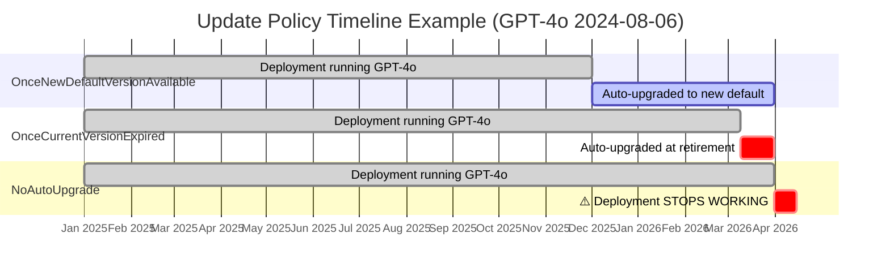

# Retirement Timeline

> **⚠️ Retirement dates and model availability change frequently.** Always verify against the **[official Azure OpenAI Model Retirements page](https://learn.microsoft.com/en-us/azure/ai-foundry/openai/concepts/model-retirements)** for the latest authoritative information.
>
> This page was last verified **July 2026**.

---

## Models Being Retired

### GPT-4o / GPT-4o-mini (Standard) — Retired

| Deployment Type | GPT-4o (2024-05-13, 2024-08-06) | GPT-4o (2024-11-20) |
|----------------|----------------------------------|---------------------|
| **Standard** | **Retired 2026-03-31** (auto-upgraded to GPT-5.1) | 2026-10-01 |
| **Provisioned** | 2026-10-01 | 2026-10-01 |
| **Global** | 2026-10-01 | 2026-10-01 |
| **DataZone** | 2026-10-01 | 2026-10-01 |

> **📝 Note:** Standard GPT-4o (05-13, 08-06) and GPT-4o-mini Standard deployments were **auto-upgraded on 2026-03-09** and **retired on 2026-03-31**. If your Standard deployments still show the old model version, they have already been upgraded behind the scenes. Non-Standard deployment types (Provisioned, Global, DataZone) still have until **2026-10-01**.

### GPT-4o-mini

| Deployment Type | GPT-4o-mini |
|----------------|-------------|
| **Standard** | **Retired 2026-03-31** (auto-upgraded to GPT-4.1-mini) |
| **Provisioned** | 2026-10-01 |
| **Global** | 2026-10-01 |
| **DataZone** | 2026-10-01 |

### GPT-4.1 Family — Deprecated (No New Customers)

> **⚠️ New (April 2026):** As of **2026-04-14**, GPT-4.1, GPT-4.1-mini, and GPT-4.1-nano are **deprecated** — no new customers can create deployments. Existing deployments continue to work until retirement on **2026-10-14**. Plan your migration to GPT-5 family now.

### o-series

| Model | Retirement Date | Replacement |
|-------|----------------|-------------|
| `o1` (2024-12-17) | **2026-09-16** | No designated replacement |
| `o1-pro` (2025-03-19) | **2026-09-18** | No designated replacement |
| `o3-mini` (2025-01-31) | **2026-10-01** | No designated replacement |

> **⚠️ Important:** `o4-mini` and `codex-mini` are already deprecated. Do not treat them as long-run migration targets solely because they are newer than the source model.

---

## Published Model Retirement Dates

Use these published dates to compare the runway of candidate models. A later retirement date is only one decision factor; availability, quality, latency, capacity, and API compatibility still require workload-specific evaluation.

| Model | GA Date | Retirement (not before) | Designated replacement |
|-------|---------|-------------------------|------------------------|
| `gpt-4.1` | 2025-04-14 | 2026-10-14 | — |
| `gpt-4.1-mini` | 2025-04-14 | 2026-10-14 | — |
| `gpt-4.1-nano` | 2025-04-14 | 2026-10-14 | — |
| `o3` | 2025-04-16 | 2026-10-16 | — |
| `o4-mini` | 2025-04-16 | 2026-10-16 | — |
| `o3-pro` | 2025-06-10 | 2026-12-10 | — |
| `codex-mini` | 2025-05-16 | 2026-11-15 | — |
| `o3-deep-research` | 2025-06-26 | 2026-12-26 | — |
| `gpt-5` | 2025-08-07 | 2027-02-06 | — |
| `gpt-5-mini` | 2025-08-07 | 2027-02-06 | — |
| `gpt-5-nano` | 2025-08-07 | 2027-02-06 | — |
| `gpt-5-codex` | 2025-09-15 | 2027-03-17 | — |
| `gpt-5-pro` | 2025-10-06 | 2027-04-07 | — |
| `gpt-5.1` | 2025-11-13 | 2027-05-15 | — |
| `gpt-5.1-codex` | 2025-11-13 | 2027-05-15 | — |
| `model-router` | 2025-11-18 | 2027-05-20 | — |
| `gpt-5.2` | 2025-12-11 | **2026-12-12** | — |
| `gpt-5.2-codex` | 2026-01-14 | **2027-01-14** | — |
| `gpt-5.3-codex` | 2026-02-24 | **2027-02-25** | — |
| `gpt-5.4` | 2026-03-05 | **2027-03-05** | — |
| `gpt-5.4-pro` | 2026-03-05 | **2027-03-06** | — |
| `gpt-5.4-mini` | 2026-03-17 | **2027-03-18** | — |
| `gpt-5.4-nano` | 2026-03-17 | **2027-03-18** | — |
| `gpt-5.5` | 2026-04-24 | **2027-04-23** | — |
| `gpt-5.6-sol` | 2026-07-09 | **2027-07-09** | — |
| `gpt-5.6-terra` | 2026-07-09 | **2027-07-09** | — |
| `gpt-5.6-luna` | 2026-07-09 | **2027-07-09** | — |

> **⚠️ Important:** Do not infer retirement by adding 18 months to a GA date. For example, `gpt-5.2` retires in December 2026 and the GPT-5.4 family retires in March 2027.

### Planning Beyond Mid-2027

Published retirement dates vary by model and can be materially shorter than a simple lifecycle estimate. Plan from the official schedule rather than projecting a date from GA.

- **Compare candidate runway explicitly** — GPT-5.5 retires in April 2027; the GPT-5.6 series retires in July 2027.
- **Recheck the schedule at every planning gate** — announcement, pilot approval, production cutover, and cleanup.
- **Keep evaluation infrastructure model-agnostic** — golden datasets, eval definitions, CI/CD gates, and Foundry dashboards carry forward to each candidate model.

For organizations with multi-year compliance timelines, the recommended approach is:

1. **Invest in evaluation infrastructure now** — golden datasets, automated CI/CD eval gates, Foundry eval definitions. This is the durable asset.
2. **Use `OnceCurrentVersionExpired` policy** on production deployments to maximize runway on each model
3. **Use `OnceNewDefaultVersionAvailable` in staging** to get early visibility into the next generation
4. **Track Azure OpenAI announcements** via [What's New](https://learn.microsoft.com/en-us/azure/ai-foundry/openai/whats-new) and Azure Service Health alerts

---

## How Azure OpenAI Retirements Work

### Deployment Types and Auto-Upgrade Behavior

| Deployment Type | What Happens at Retirement |
|----------------|---------------------------|
| **Standard** | Auto-upgraded to the designated replacement model on the upgrade date. No action required, but behavior may change. |
| **Provisioned** | Must be manually redeployed before retirement date. Provisioned throughput units (PTUs) are released. |
| **Global** | Auto-upgraded. Same behavior as Standard but routed across regions. |
| **DataZone** | Auto-upgraded. Same behavior as Standard but with data residency guarantees. |

### Model Version Update Policies (Standard Deployments)

Every Standard deployment has a **version update policy** that controls if and when it auto-upgrades. This is the setting that most often confuses teams — especially because the default behavior may not be what you expect.

| Policy | API value | What it does | When it triggers |
|--------|-----------|-------------|-----------------|
| **Auto-update to default** | `OnceNewDefaultVersionAvailable` | Upgrades within ~2 weeks of a new default version being designated | Proactively, as soon as a new default is available |
| **Upgrade at expiration** | `OnceCurrentVersionExpired` | Upgrades to the current default version when your pinned version reaches its retirement date | Only at retirement — can be months or years later |
| **No auto-upgrade** | `NoAutoUpgrade` | Never upgrades automatically. **⚠️ Deployment stops working at retirement.** | Never — deployment is deleted/disabled at retirement |

> **⚠️ Critical:** If your policy is `NoAutoUpgrade` and you don't act before retirement, your deployment **stops accepting requests**. There is no grace period.

> **Default behavior:** If you haven't explicitly set a policy, the effective value is `OnceCurrentVersionExpired` — your deployment will auto-upgrade at retirement, but not before. This is the most common scenario.


```mermaid
gantt
    title Update Policy Timeline Example (GPT-4o 2024-08-06)
    dateFormat YYYY-MM-DD
    axisFormat %b %Y

    section OnceNewDefaultVersionAvailable
    Deployment running GPT-4o       :done, a1, 2025-01-01, 2025-12-01
    Auto-upgraded to new default    :active, a2, 2025-12-01, 2026-03-31

    section OnceCurrentVersionExpired
    Deployment running GPT-4o       :done, b1, 2025-01-01, 2026-03-09
    Auto-upgraded at retirement     :crit, b2, 2026-03-09, 2026-03-31

    section NoAutoUpgrade
    Deployment running GPT-4o       :done, c1, 2025-01-01, 2026-03-31
    ⚠️ Deployment STOPS WORKING    :crit, c2, 2026-03-31, 2026-04-15
```

### How to Check and Change Your Policy

**Azure Portal:** Go to your Azure OpenAI resource → **Deployments** → select a deployment → **Properties** → look for *"Version update policy"*.

**Azure CLI:**

```bash
# List all deployments and their update policies
az cognitiveservices account deployment list \
  --name YOUR_RESOURCE_NAME \
  --resource-group YOUR_RG \
  --query "[].{name:name, model:properties.model.name, version:properties.model.version, policy:properties.versionUpgradeOption}" \
  -o table
```

```bash
# Change a deployment's update policy
az cognitiveservices account deployment create \
  --name YOUR_RESOURCE_NAME \
  --resource-group YOUR_RG \
  --deployment-name YOUR_DEPLOYMENT \
  --model-name gpt-4o \
  --model-version "2024-08-06" \
  --model-format OpenAI \
  --sku-capacity 120 \
  --sku-name "Standard" \
  --version-upgrade-option "OnceCurrentVersionExpired"
```

**PowerShell:**

```powershell
# Set a deployment to NoAutoUpgrade (pin the version)
$deployment = Get-AzCognitiveServicesAccountDeployment `
  -ResourceGroupName YOUR_RG -AccountName YOUR_RESOURCE -Name YOUR_DEPLOYMENT
$deployment.Properties.VersionUpgradeOption = "NoAutoUpgrade"
New-AzCognitiveServicesAccountDeployment `
  -ResourceGroupName YOUR_RG -AccountName YOUR_RESOURCE `
  -Name YOUR_DEPLOYMENT -Properties $deployment.Properties -Sku $deployment.Sku
```

### Which Policy Should I Use?

| Scenario | Recommended policy | Why |
|----------|-------------------|-----|
| **Dev/test environments** | `OnceNewDefaultVersionAvailable` | Get the latest model early to start testing |
| **Production — can tolerate model changes** | `OnceCurrentVersionExpired` (default) | Auto-upgrades at retirement, giving you maximum runway on the current model |
| **Production — strict change control** | `NoAutoUpgrade` | Full control over when you migrate. **But you must monitor retirement dates and act before expiry, or your deployment breaks.** |
| **Staging / pre-prod** | `OnceNewDefaultVersionAvailable` | Mirrors what production will eventually get; gives you a preview window to test |

> **Recommended pattern:** Use `OnceNewDefaultVersionAvailable` in staging + `OnceCurrentVersionExpired` in production. This gives you early visibility in staging while preserving stability in production until the retirement date forces a change.

### Provisioned Deployments — Manual Migration Required

Provisioned (PTU) deployments do **not** support automatic model upgrades. You must migrate manually using one of two approaches:

| Approach | How it works | Downtime |
|----------|-------------|----------|
| **In-place migration** | Change the model version or family on the existing deployment. Azure migrates traffic over a 20–30 minute window. | Minimal (~20–30 min, deployment stays responsive) |
| **Multi-deployment migration** | Create a new deployment with the target model, gradually shift traffic, then delete the old one. | Zero (blue-green) |

> **In-place migrations** are simpler but give you less control. **Multi-deployment migrations** require more quota (two deployments running simultaneously) but allow gradual traffic shifting and rollback.

### Key Concepts

- **"Retirement (not before)"** — Microsoft guarantees the model will be available until at least this date. The actual retirement may be later.
- **Auto-upgrade** — For Standard/Global/DataZone deployments, Microsoft automatically switches your deployment to the replacement model. Your endpoint URL stays the same, but the model behind it changes.
- **No-longer-available (NLA)** — After retirement, the model cannot be deployed or re-deployed. Existing deployments with `NoAutoUpgrade` stop working.

### Incident Response & Rollback

If a migration (auto-upgrade or manual) introduces a regression in production, here's what to do based on your deployment type:

| Deployment Type | Rollback Options |
|----------------|-----------------|
| **Standard (auto-upgraded)** | 1. Create a **new deployment** with the previous model version (if still available before retirement). 2. Adjust prompts/parameters to work with the upgraded model. 3. Contact Azure Support for urgent cases — reference your subscription ID, resource group, and deployment name. |
| **Standard (NoAutoUpgrade)** | Re-deploy the same model version — it hasn't changed. Investigate why you're seeing issues (likely a code or config change, not the model). |
| **Provisioned (in-place)** | In-place migrations cannot be reverted once complete. Use a **multi-deployment strategy** (below) to avoid this. |
| **Provisioned (multi-deployment)** | Shift traffic back to the old deployment. This is why multi-deployment (blue-green) is recommended for critical workloads. |

**Prevention — recommended pattern for production:**

1. **Before any upgrade window:** run your [evaluation suite](evaluation-guide.md) against the target model in a staging deployment
2. **Use `NoAutoUpgrade`** on critical production deployments so you control the timing
3. **Multi-deployment migration** for Provisioned workloads — keep the old deployment alive until you've validated the new one
4. **Monitor post-migration:** track error rates, latency P95, and user-reported quality for at least 48 hours after cutover
5. **Escalation:** if you discover a model-level regression (not prompt/config), file an Azure Support ticket with before/after examples from your evaluation suite

> **Key point:** Auto-upgraded Standard deployments cannot be "rolled back" to the old model after retirement. The mitigation is to test *before* the auto-upgrade window using a staging deployment with `OnceNewDefaultVersionAvailable`.

### What You Should Do

1. **Inventory your deployments** — Know which models, deployment types, and update policies you're using. Use the CLI command above, or see the [Lifecycle Best Practices guide](llm-upgrade-lifecycle-best-practices.md).
2. **Check your update policies** — Especially look for `NoAutoUpgrade` deployments that will break at retirement.
3. **Test before the auto-upgrade date** — Run your evaluation suite against the replacement model. See the [Evaluation Guide](evaluation-guide.md).
4. **For Provisioned deployments** — Plan your in-place or multi-deployment migration well before the retirement date.
5. **Set up notifications** — Use Azure Service Health alerts to get notified of upcoming retirements. See the [Lifecycle Best Practices guide](llm-upgrade-lifecycle-best-practices.md#2-monitor-notifications).

---

## Planning Your Migration

| If you're on... | Urgency | Recommended action |
|----------------|---------|-------------------|
| GPT-4o Standard (05-13, 08-06) | ✅ **Complete** — retired 2026-03-31 | Already auto-upgraded to GPT-5.1. Verify quality with [Evaluation Guide](evaluation-guide.md). |
| GPT-4o-mini Standard | ✅ **Complete** — retired 2026-03-31 | Already auto-upgraded to GPT-4.1-mini. Verify quality. |
| GPT-4o non-Standard (Provisioned, Global, DataZone) | 🟡 **Plan by Q3 2026** | Retirement 2026-10-01. Create new deployment with target model. |
| GPT-4o (11-20) any | 🟡 **Plan by Q3 2026** | Retirement 2026-10-01. |
| GPT-4.1 family | 🟡 **Deprecated today** — plan migration | No new deployments. Retirement 2026-10-14. Migrate to GPT-5 family. |
| o1 | 🔴 **Act now** | Retirement 2026-09-16. No designated replacement; evaluate current GA reasoning models. |
| o1-pro | 🔴 **Act now** | Retirement 2026-09-18. No designated replacement; evaluate current GA reasoning models. |
| o3-mini | 🔴 **Act now** | Retirement 2026-10-01. No designated replacement; do not default to deprecated `o4-mini`. |
| GPT-5.2 | 🟡 **Plan in 2026** | Retirement 2026-12-12. Do not assume mid-2027 runway. |
| GPT-5.4 family | 🟡 **Plan for Q1 2027** | Retirement dates are 2027-03-05 through 2027-03-18. |
| GPT-5.5 / GPT-5.6 | 🟢 **Monitor** | Published retirement dates are 2027-04-23 and 2027-07-09 respectively. |

---

## Official Sources

- **[Azure OpenAI Model Retirements](https://learn.microsoft.com/en-us/azure/ai-foundry/openai/concepts/model-retirements)** — authoritative retirement dates (always check this)
- **[Azure OpenAI Models Overview](https://learn.microsoft.com/en-us/azure/ai-services/openai/concepts/models)** — capabilities and regional availability
- **[What's New in Azure OpenAI](https://learn.microsoft.com/en-us/azure/ai-foundry/openai/whats-new)** — latest changes and announcements

---

## Next Steps

- **[Migration Paths](migration-paths.md)** — choose your target model
- **[API Changes](api-changes-by-model.md)** — code-level changes needed
- **[Evaluation Guide](evaluation-guide.md)** — validate quality before deploying
